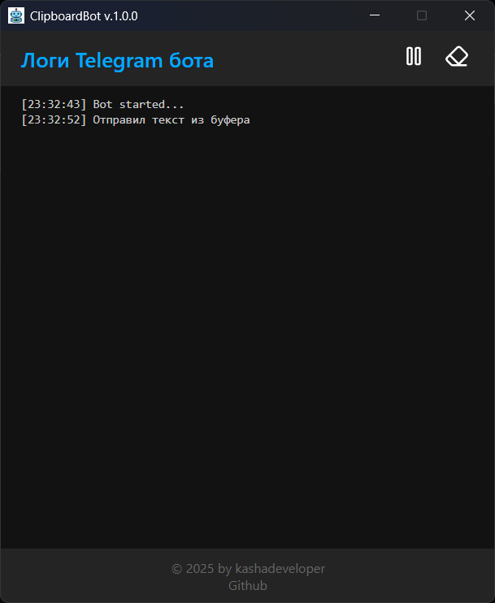

# 📋 ClipboardBot

Electron-приложение для управления буфером обмена через Telegram-бота.  
Поддерживает получение и очистку буфера, копирование текста и отправку изображений и файлов.

---

## 🚀 Возможности

- 📥 Копирование текста из сообщений Telegram в буфер обмена
- 📤 Получение текста, изображений и файлов из буфера
- ❌ Очистка буфера
- ⚙️ Настройки через интерфейс
---

## 🛠️ Установка

В примерах приведен пакетный менеджер ``npm``. Вы можете использовать любой пакетный менеджер, совместимый с node >= 18

1. Клонируйте репозиторий:

   ```bash
   git clone https://github.com/kashadeveloper/clipboardbot.git
   cd clipboardbot
   ```

2. Установите зависимости:

   ```bash
   npm install
   ```

---

## ▶️ Запуск

```bash
npm run dev
```

---

## 📦 Сборка

Для Windows:

```bash
npm run build:win
```

Сборка появится в папке `dist/`.

---

## 📸 Скриншоты

<p align="center">
  
</p>

---

## 🧑‍💻 Автор

kashadeveloper

---

## 📝 Лицензия

MIT
